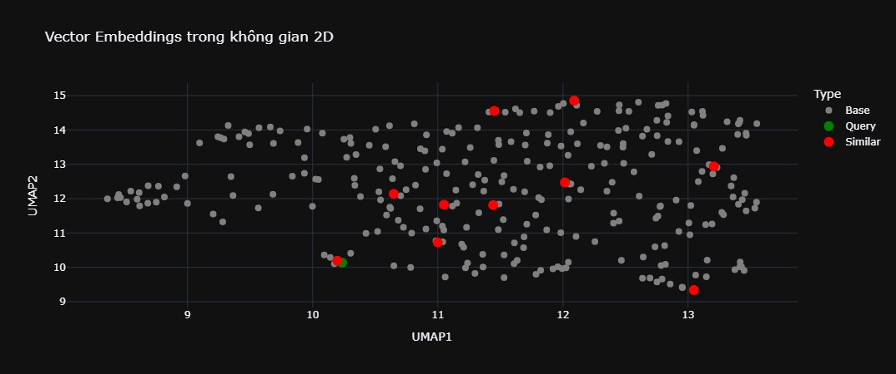

# UndertakerAi - A RAG Chatbot for "86 - Eighty Six" Light Novel

**UndertakerAi** is a chatbot using Retrieval-Augmented Generation (RAG) technology that allows users to chat and ask questions about the world of the popular light novel **"86 - Eighty Six"** by Asato Asato.

**UndertakerAi** là một chatbot sử dụng kỹ thuật Retrieval-Augmented Generation (RAG), cho phép người dùng trò chuyện và đặt câu hỏi xoay quanh thế giới của light novel nổi tiếng **"86 - Eighty Six"** của tác giả Asato Asato.

## 🧠 Giới thiệu

"86" là một bộ light novel khai thác các chủ đề như phân biệt chủng tộc, chiến tranh, AI và danh tính con người. Dự án này nhằm tái hiện lại những thông tin, sự kiện, và đoạn đối thoại từ tiểu thuyết thông qua một chatbot đối thoại tự nhiên và thông minh, như thể bạn đang kết nối qua **Para-RAID** thật sự.

## 🚀 Tính năng

-   ✅ Hỏi đáp theo ngữ cảnh light novel "86"
-   ✅ Trích xuất thông tin chính xác từ các đoạn văn bản gốc
-   ✅ Hỗ trợ tiếng Việt
-   ✅ Giao diện CLI hoặc API tương tác

## 📦 Cấu trúc dự án

```bash
├── dataset.txt            # Dữ liệu từ light novel gốc (đã xử lý)
│
├── build.ipynb            # Notebook tiền xử lý và xây dựng index
│
├── apikey.py              # File chứa apikey
│
├── README.md
```

### 📁 Tệp tin chính

-   [dataset.txt](dataset.txt) - Dữ liệu từ light novel gốc (đã xử lý)
-   [build.ipynb](build.ipynb) - Notebook tiền xử lý và xây dựng index
-   [apikey.py](apikey.py) - File chứa apikey

## ⚙️ Công nghệ sử dụng

-   Python 3.10+
-   LangChain
-   FAISS
-   HuggingFace Transformers
-   SentenceTransformers (embedding)

## 📄 Hướng dẫn sử dụng

### 1. Cài đặt

```bash
git clone https://github.com/PhucHuwu/Undertaker-Ai.git
cd Undertaker-Ai
```

### 2. Tiền xử lý dữ liệu

Chạy file [build.ipynb](build.ipynb) để:

-   Cắt đoạn văn thành chunks
-   Tạo embedding
-   Lưu trữ vào vector store

### 3. Ví dụ tương tác

```text
> Người dùng: Thông tin của Shin
> Bot: Thông tin về Shin:
       * Shin là một thiếu tá trong binh đoàn Spearhead.
       * Cậu có vẻ bình tĩnh, già dặn và lạnh lùng, không bao giờ bị lung lay.
       * Cậu có thể đồng bộ với người khác, nghe được tiếng nói của họ và nói chuyện với họ.
       * Cậu có thể khống chế và tiêu diệt quân địch với kỹ năng chiến đấu cao.
       * Cậu có một cảm xúc bí mật, mong muốn không quên và được nhớ tới.
       * Cậu có thể nói những lời không bình thường, ví dụ như đọc kinh thánh.
       * Cậu có thể kiểm soát và điều chỉnh thiết bị RAID, đồng bộ với người khác.
       * Cậu có quan hệ đặc biệt với Lena, có thể nói chuyện với cô và hiểu cảm xúc của cô.
```


_Hình ảnh minh họa vector space của các đoạn văn trong dataset sau khi được embedding_

## 🧩 Cần chuẩn bị

-   Dataset gốc từ tiểu thuyết (đã xử lý) - xem [dataset.txt](dataset.txt)
-   API key từ [Groq](https://groq.com/) - cần được thêm vào [apikey.py](apikey.py)

## 📜 Bản quyền

Nội dung light novel thuộc bản quyền của **Asato Asato** và **Kadokawa**. Đây là dự án phi lợi nhuận nhằm mục đích nghiên cứu và học tập.

---

> "Cái chết của họ bị che giấu trong sự yên bình giả tạo. Nhưng chúng tôi vẫn nhớ tên từng người." — Lena
